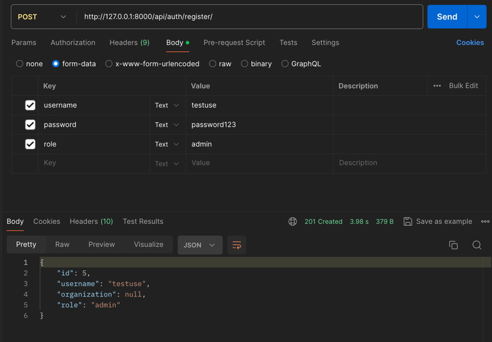
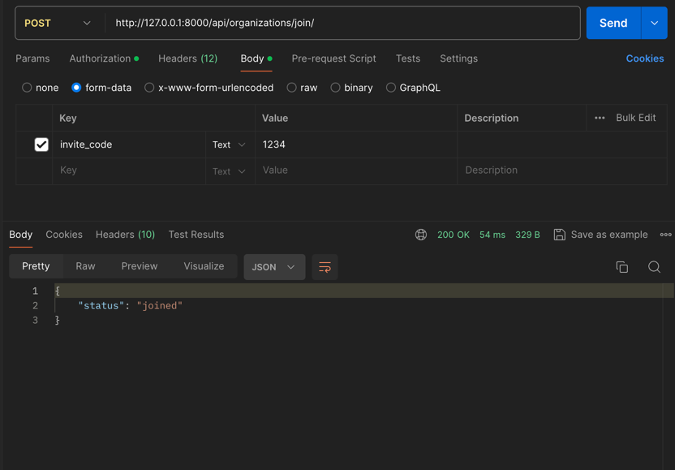

# MLOps Backend Service

## Setup

1. Clone the repository.
2. Create a virtual env: `python3.12 -m venv venv`
3. Install dependencies: `pip install -r requirements.txt`
4. Apply migrations: `python manage.py migrate`
5. Run the server: `python manage.py runserver`

Run with docker:

```bash
docker-compose build
docker-compose up
```

## API Endpoints


- Register a new user `POST /api/auth/register/`  
``` bash
curl -X POST -H "Content-Type: application/json" -d '{"username": "testuser", "password": "password123"}' http://127.0.0.1:8000/api/auth/register/
```

- Login: `POST /api/auth/login/`
``` bash
curl -X POST -H "Content-Type: application/json" -d '{"username": "testuser", "password": "password123"}' http://127.0.0.1:8000/api/auth/login/
```

- Create Organization: `POST /api/organizations/`
```bash
curl -X POST -H "Authorization: Bearer <access_token>" -H "Content-Type: application/json" -d '{"name": "Test Org", "invite_code": "1234"}' http://127.0.0.1:8000/api/organizations/
```

- Join Organization: `POST /api/organizations/join/`
```bash
curl -X POST -H "Authorization: Bearer <access_token>" -H "Content-Type: application/json" -d '{"invite_code": "1234"}' http://127.0.0.1:8000/api/organizations/join/
```

- Create Cluster: `POST /api/clusters/`
```bash
curl -X POST -H "Authorization: Bearer <access_token>" -H "Content-Type: application/json" -d '{"name": "Test Cluster", "organization": 1, "total_ram": 1024, "total_cpu": 4, "total_gpu": 1, "available_ram": 1024, "available_cpu": 4, "available_gpu": 1}' http://127.0.0.1:8000/api/clusters/
```

- Create Deployment: `POST /api/deployments/`
```bash
curl -X POST -H "Authorization: Bearer <access_token>" -H "Content-Type: application/json" -d '{"cluster": 1, "docker_image_path": "path/to/image", "required_ram": 512, "required_cpu": 2, "required_gpu": 1, "priority": 10}' http://127.0.0.1:8000/api/deployments/
```


- List Deployment: `GET /api/deployments/`
```bash
curl -X POST -H "Authorization: Bearer <access_token>" -H "Content-Type: application/json"  http://127.0.0.1:8000/api/deployments/
```

## Running Tests

Run tests with the following command:

```bash
python manage.py test core
```


